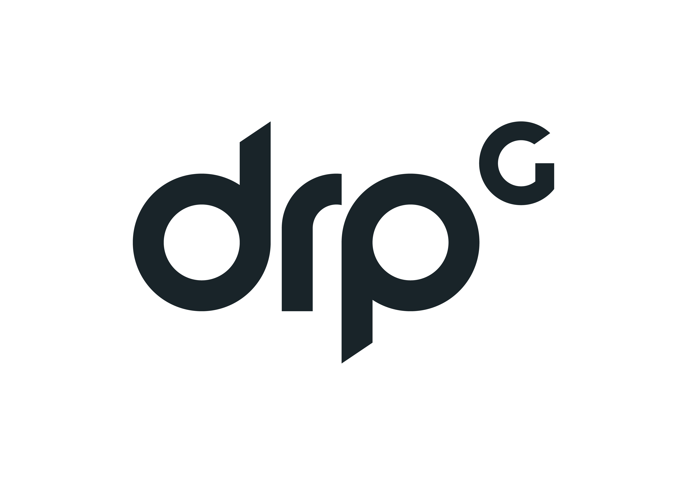

    

<h3 align="center">BrumAI Website</h3>

  A sleek, intuitive, and powerful front-end framework for Birmingham's premiere AI events organisation.
   
   
  <a href="https://team-architects.github.io/"><strong>Explore BrumAI docs »</strong></a>
   
   
  <a href="https://brum-ai-test.netlify.app/">View the website</a>

## Branches A2, B, C

Our default branches for development are Branch A2, Branch B and Branch C, allowing for the distribution of labour in a team.

## Table of contents

- [Quick start](#quick-start)
- [Status](#status)
- [Documentation](#documentation)
- [Running Documentation Locally](#running_documentation_locally)
- [Making Ammendments](#making_amendments)
- [Community](#community)
- [Creators](#creators)
- [Sponsors](#sponsors)
- [Buy Us A Coffee](#buy_us_a_coffee)

## Quick start

## Status

## Documentation

[BrumAI's documentation](https://team-architects.github.io), are publicly hosted on GitHub Pages. The docs may also be run locally.
[The BrumAI website](https://brum-ai-test.netlify.app/), is hosted on Netlify.

Our documentation search is powered by [Algolia's DocSearch](https://docsearch.algolia.com/).

### Running_Documentation_Locally

1. Run `npm install` to install the Node.js dependencies, including Hugo (the site builder).
2. Run `npm run dev` to run the development server for the project.
3. Open `http://localhost:3000/` in your browser, and voilà.

## Making_Ammendments

Please see the data file located at 'app/data/data.js' to make ammendments to the dats in the project. We have structured the project in a way to ensure the centralisation of data here to allow for the project to be as maintainable as possible. 

## Community

- See our [LinkTree](http://linktr.ee/brumai).
- Join our events, book on [Meetup](https://meetup.com/brum-ai).
- Follow [@brum_AI on X](https://x.com/brum_AI).
- Follow [BrumAI on LinkedIn](https://www.linkedin.com/company/brumai/).
- Join the [Slack channel](brumai.slack.com).
- Watch our [YouTube videos](https://www.youtube.com/@brumai5129).
- Join the [Discord](https://tr.ee/xidkxXUO2K).
- Follow us on [Instagram](https://www.instagram.com/brum_ai_/).
- Follow us on [Facebook](https://www.instagram.com/brum_ai_/).

## Creators

**David Mason**

- <https://x.com/DavidMason1702>
- <https://github.com/DayHikari>
- <https://www.linkedin.com/in/davidianmason1702/>

**Cal Woodford**

- <https://calwoodford.com>
- <https://x.com/calwoodford>
- <https://github.com/calwoodford>
- <https://www.linkedin.com/in/callumwoodford/>

**Taimoor Balal**

- <https://x.com/TayKhanTexas>
- <https://github.com/TayKhanTexas>

**Samantha German**

- <https://github.com/sam1234g>
- <https://www.linkedin.com/in/samantha-german-241265289/>

**Alexander Brown**

- <https://github.com/alexjbrowntech>
- <https://www.linkedin.com/in/alexgeoffrey/>

**Katarzyna Baginska**

- <https://x.com/coding_kate>
- <https://github.com/KatBaginska>
- <https://www.linkedin.com/in/katarzyna-baginska-0baa4a152/>

## Sponsors

## Buy_Us_A_Coffee

